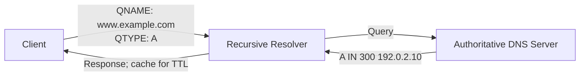

# DNS Domains and Records

The Domain Name System (DNS) is a distributed database that associates
human-readable domain names with information such as IP addresses, mail
servers, service locations, and security keys. Its basic unit of data is a
**Resource Record (RR)**.
This is a learning-oriented guide. The IANA
 [DNS Resource Record TYPEs registry](https://www.iana.org/assignments/dns-parameters/dns-parameters.xhtml#dns-parameters-4)
is the authoritative, current list of registered RR types. New types can be
added, so the tables here cover important and commonly encountered types rather
than every registered type.

## Record Structure

Conceptually, each DNS record has these fields:

```text
NAME  TYPE  CLASS  TTL  RDATA
```

| Field | Meaning | Example |
| `NAME` | The domain name that owns the record | `www.example.com.` |
| `TYPE` | The kind of data | `A`, `MX`, `TXT` |
| `CLASS` | DNS class; almost always `IN` for the Internet | `IN` |
| `TTL` | Cache lifetime in seconds | `300` |
| `RDATA` | Data whose format depends on `TYPE` | `192.0.2.10` |

A collection with the same `NAME`, `TYPE`, and `CLASS` is called an **RRset**.
A client usually sends a `QNAME` (the name) and a `QTYPE` (the requested record
type) in its query.



An entry such as `example.com. 300 IN A 192.0.2.10` uses the conventional DNS
zone-file notation. It is not the INI format used by Autobricks DNS.

## Addresses and Aliases

| Type | Code | Purpose | RDATA form | Example |
| --- | ---: | --- | --- | --- |
| `A` | 1 | Maps a name to an IPv4 address | IPv4 address | `www.example.com. 300 IN A 192.0.2.10` |
| `AAAA` | 28 | Maps a name to an IPv6 address | IPv6 address | `www.example.com. 300 IN AAAA 2001:db8::10` |
| `CNAME` | 5 | Identifies the canonical name for an alias | Domain name | `www.example.com. IN CNAME web.example.net.` |
| `DNAME` | 39 | Redirects a branch of the DNS name tree | Domain name | `old.example. IN DNAME new.example.` |
| `PTR` | 12 | Points a name to another name; commonly used for reverse DNS | Domain name | `10.2.0.192.in-addr.arpa. IN PTR host.example.com.` |

A `CNAME` owner generally cannot have other data records at the same name.
Multiple `A` or `AAAA` records may exist for the same name, and both are often
published together to provide IPv4 and IPv6 connectivity.

## Authority and Delegation

| Type | Code | Purpose | RDATA form | Example |
| --- | ---: | --- | --- | --- |
| `NS` | 2 | Identifies an authoritative name server for a zone | Domain name | `example.com. IN NS ns1.example.net.` |
| `SOA` | 6 | Marks zone authority and carries maintenance data | Multiple fields | `example.com. IN SOA ns1.example.net. hostmaster.example.com. ...` |
| `DS` | 43 | DNSSEC delegation information stored in the parent zone | Key tag, algorithm, digest | `example.com. IN DS 12345 13 2 ...` |
| `CDS` | 59 | Signals DS data that a child wants a parent to publish | DS format | `example.com. IN CDS 12345 13 2 ...` |
| `CDNSKEY` | 60 | Child zone DNSKEY data for parent synchronization | DNSKEY format | `example.com. IN CDNSKEY 257 3 13 ...` |
| `CSYNC` | 62 | Signals child-to-parent delegation synchronization | Serial, flags, type bitmap | `example.com. IN CSYNC 2026092301 3 A AAAA` |

`NS` and `SOA` are fundamental when operating authoritative DNS zones.
Autobricks DNS is not a full authoritative zone server or zone-transfer server,
so it does not provide these records locally.

## Mail and Service Discovery

| Type | Code | Purpose | RDATA form | Example |
| --- | ---: | --- | --- | --- |
| `MX` | 15 | Mail receiver and its preference | Preference, host | `example.com. IN MX 10 mail.example.com.` |
| `SRV` | 33 | Host and port for a named service | Priority, weight, port, target | `_sip._tcp.example.com. IN SRV 10 5 5060 sip.example.com.` |
| `NAPTR` | 35 | Naming rewrite and service rules | Order, preference, flags, service, regexp, replacement | Common in telecommunications systems |
| `SVCB` | 64 | General service binding and connection parameters | Priority, target, parameters | `_443._https.example.com. IN SVCB 1 svc.example.net. alpn=h3` |
| `HTTPS` | 65 | SVCB-compatible record for HTTP and HTTPS | Same as SVCB | `example.com. IN HTTPS 1 . alpn=h2,h3` |
| `URI` | 256 | A URI with priority and weight | Priority, weight, URI | `_service.example.com. IN URI 10 1 "https://api.example.com/"` |

Lower `MX` preference values are preferred. `SRV` normally uses names such as
`_service._tcp` or `_service._udp`. `SVCB` and `HTTPS` are modern record types
that can provide alternative endpoints, ports, and supported protocol details.

## Text, Certificates, and Keys

| Type | Code | Purpose | RDATA form | Example |
| --- | ---: | --- | --- | --- |
| `TXT` | 16 | Text policies and verification data | Character string | `example.com. IN TXT "v=spf1 -all"` |
| `CAA` | 257 | Restricts which certificate authorities may issue certificates | Flags, tag, value | `example.com. IN CAA 0 issue "letsencrypt.org"` |
| `TLSA` | 52 | TLS certificate or public-key association for DANE | Usage, selector, matching type, data | `_443._tcp.example.com. IN TLSA 3 1 1 ...` |
| `SSHFP` | 44 | SSH host key fingerprint | Algorithm, fingerprint type, fingerprint | `host.example.com. IN SSHFP 4 2 ...` |
| `OPENPGPKEY` | 61 | OpenPGP public key | Public-key data | `_openpgpkey.example.com. IN OPENPGPKEY ...` |
| `SMIMEA` | 53 | S/MIME certificate association | TLSA-like fields | `_smimecert.example.com. IN SMIMEA 3 1 1 ...` |

`TXT` is widely used for SPF, DKIM, DMARC, and domain-ownership verification,
but the record type does not define the text's meaning. The protocol using the
record defines how to interpret it.

## DNSSEC

| Type | Code | Purpose |
| --- | ---: | --- |
| `DNSKEY` | 48 | DNSSEC public key for a zone |
| `RRSIG` | 46 | Digital signature over an RRset |
| `NSEC` | 47 | Proof that a name or record type does not exist |
| `NSEC3` | 50 | Hashed proof of nonexistence |
| `NSEC3PARAM` | 51 | Parameters used by NSEC3 hashing |

DNSSEC does not encrypt DNS data. It lets a resolver verify that DNS data has
not been forged or modified. Its chain of trust leads from a parent's `DS`
record to the child zone's `DNSKEY` record.

## Other Useful Types

| Type | Code | Purpose |
| --- | ---: | --- |
| `OPT` | 41 | Pseudo-record carrying EDNS extension options; not zone data |
| `TSIG` | 250 | DNS message authentication |
| `TKEY` | 249 | Transaction-key negotiation |
| `AXFR` | 252 | Full zone-transfer query type; not ordinary data |
| `IXFR` | 251 | Incremental zone-transfer query type; not ordinary data |
| `ZONEMD` | 63 | Message digest over zone data |
| `LOC` | 29 | Geographic location data |
| `CERT` | 37 | Certificate data |
| `HINFO` | 13 | Host hardware and operating-system information; rarely used today |
| `SPF` | 99 | Historic SPF-only type; SPF is now normally published in `TXT` |

`AXFR`, `IXFR`, and `OPT` appear in the IANA RR type registry, but they are not
ordinary data records stored in a zone file for a host.

## Autobricks DNS Configuration

Autobricks DNS deliberately provides only **local A and AAAA records**. It
does not accept local `MX`, `CNAME`, `TXT`, `NS`, or DNSSEC-related records in
its INI configuration.

```ini
[server]
bind = 0.0.0.0:53
upstream = 8.8.8.8:53

[api.example.internal]
A = 10.10.0.10
AAAA = fd00::10
```

Names not present in the local records are forwarded to `upstream` when one is
configured. For a locally known name, a query for a type other than `A` or
`AAAA` receives an empty successful response. This design is intended for
simple internal-name mapping, not as a replacement for a complete authoritative
DNS server.

## Try It

When the server is running on `127.0.0.1:5353`, query it with:

```sh
dig @127.0.0.1 -p 5353 api.example.internal A
dig @127.0.0.1 -p 5353 api.example.internal AAAA
dig @127.0.0.1 -p 5353 api.example.internal MX
```

## References

- [IANA DNS Parameters: Resource Record TYPEs](https://www.iana.org/assignments/dns-parameters/dns-parameters.xhtml#dns-parameters-4): authoritative current registry of RR types and codes
- [RFC 1035: Domain Names - Implementation and Specification](https://www.rfc-editor.org/rfc/rfc1035.html): DNS messages, RR structure, and core A/NS/CNAME/SOA/PTR/MX/TXT types
- [RFC 3596: DNS Extensions to Support IPv6](https://www.rfc-editor.org/rfc/rfc3596.html): AAAA records and IPv6 reverse lookups
- [RFC 9460: SVCB and HTTPS Resource Records](https://www.rfc-editor.org/rfc/rfc9460.html): SVCB and HTTPS records
